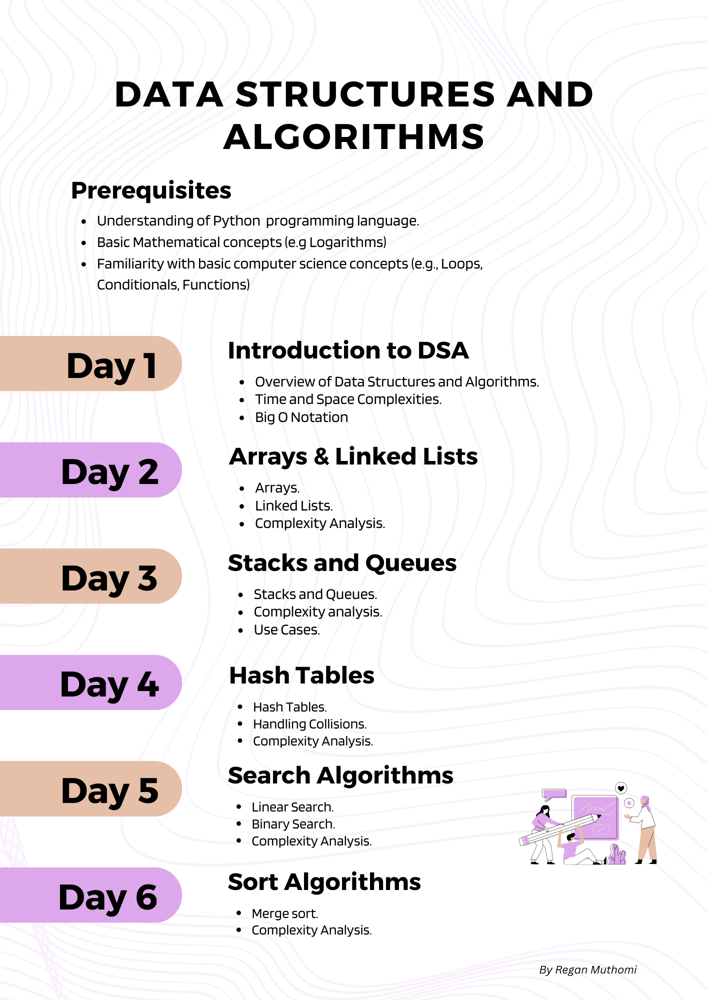

# Data Structures and Algorithms

Welcome to Data Structures and Algorithms training, a comprehensive course that will help you master the fundamentals of Data structures and algorithms.

## Course Outline

| Day | Topic | Video Recording |
| :----: | :---: | :---: |
| Day 1 | Introduction to DSA |  |
| Day 2 | Arrays and Linked Lists |  |
| Day 3 | Stacks and Queues |  |
| Day 4 | Hash Maps |  |
| Day 5 | Search Algorithms |  |
| Day 6 | Sorting Algorithms |  |
...

### In the future, we hope to create another course focussed at more advanced structures like Trees, Graphs, Heaps and Algorithmic Thinking in programming.
